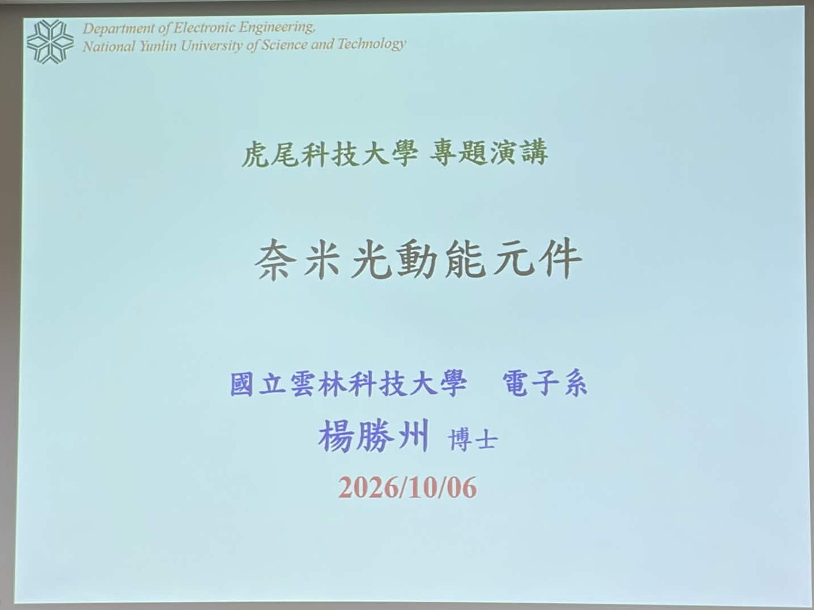
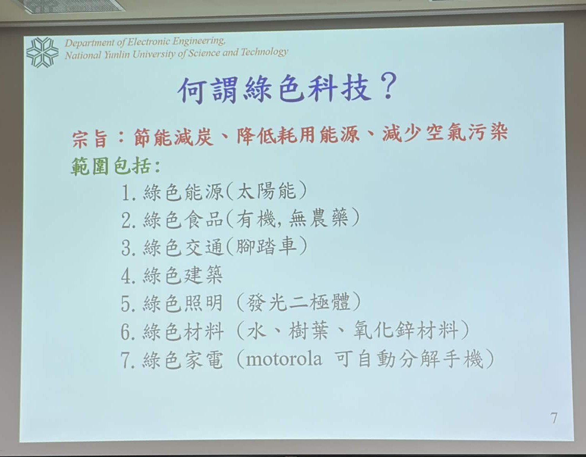
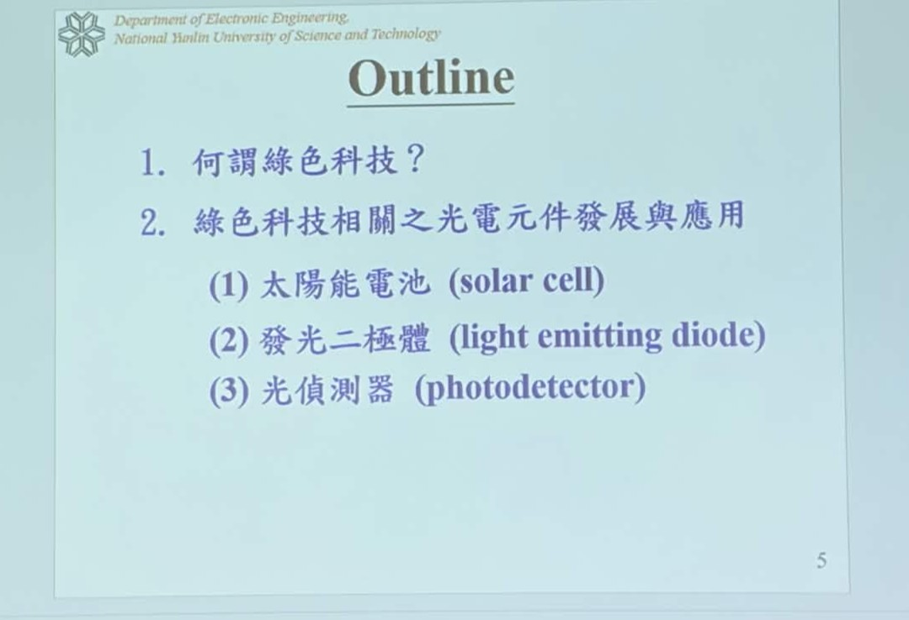

# 奈米光動能元件 筆記整理

## 1. 日期、講者、題目

| 項目 | 內容 |
|---|---|
| 日期 | 2026/10/06 |
| 場合 | 虎尾科技大學 專題演講 |
| 講者 | 楊勝州 博士（國立雲林科技大學 電子工程系 教授） |
| 題目 | 奈米光動能元件 |

---

## 2. 簡介

本次演講以「綠色科技」為主軸，由講者從自身的學術與職涯歷程談起，介紹與節能減碳相關的光電元件發展與應用，並分享對能源、AI 與半導體產業的觀察及對學生的職涯建議。內容可分為以下幾個部分：

1. **何謂綠色科技**：以節能減碳、降低耗用能源、減少空氣污染為宗旨，範圍涵蓋能源、交通、建築、照明、材料等面向。
2. **綠色科技相關之光電元件**：太陽能電池、發光二極體（LED）與光偵測器，其中以**三代太陽能電池**（矽基、染料敏化、鈣鈦礦）的發展為重點。
3. **產業趨勢觀察**：「誰擁有電力，誰就擁有未來」的能源議題、AI 晶片與矽光子，以及台積電、聯發科等業界的工作現實。
4. **職涯與學習建議**：跨領域能力、英文能力、主動解決問題的人格特質。

核心主張是：能源將是 AI 時代最關鍵的資源之一，而光電半導體元件正是綠色能源的基礎；學生除了專業能力之外，更需要培養**跨領域整合**與**主動解決問題**的能力，才能在快速變動的產業中找到自己的位置。

---

## 3. 相關技術說明

### 3.1 何謂綠色科技？

- **宗旨**：節能減碳、降低耗用能源、減少空氣污染。
- **範圍包括**：

| 類別 | 內容 / 例子 |
|---|---|
| 綠色能源 | 太陽能 |
| 綠色食品 | 有機、無農藥 |
| 綠色交通 | 腳踏車 |
| 綠色建築 | — |
| 綠色照明 | 發光二極體（LED） |
| 綠色材料 | 水、樹葉、氧化鋅材料 |
| 綠色家電 | Motorola 可自動分解手機 |

### 3.2 綠色科技相關之光電元件

演講技術部分的大綱如下：

1. 何謂綠色科技？
2. 綠色科技相關之光電元件發展與應用
   1. 太陽能電池（solar cell）：將光能轉換為電能，屬於**綠色能源**。
   2. 發光二極體（light emitting diode, LED）：高效率發光元件，屬於**綠色照明**。
   3. 光偵測器（photodetector）：將光訊號轉換為電訊號的感測元件。

講者的研究即圍繞在上述元件，專長為**光電半導體**與**固態電子元件**（電晶體、記憶體、LED、感測器），並具備電性量測與材料分析的技術能力。從其發表的論文來看，研究主題包括氧化鋅（ZnO）奈米柱紫外光偵測器、結合染料敏化太陽能電池的**自供電（self-powered）元件**，以及鈣鈦礦量子點與 ZnO 奈米柱複合的寬頻光偵測器等，正好對應本次演講題目「奈米光動能元件」。

### 3.3 太陽能電池技術發展

| 世代（依講者分類） | 技術 | 特性 | 應用 / 現況 |
|---|---|---|---|
| 第一代 | 矽基太陽能電池（Silicon-based） | 單晶矽、多晶矽、非晶矽；仰賴 PN 接面 | 主要用於戶外發電 |
| 第二代 | 染料敏化太陽能電池（DSSC） | 完全透明、可彎曲、可裝飾 | 適合室內光源發電，主要仍在學術研究階段 |
| 第三代 | 鈣鈦礦太陽能電池（Perovskite） | 近年迅速崛起的熱門材料 | 台灣已有相關公司成立，可應用於建築外牆 |

**第一代：矽基太陽能電池**
- **種類**：單晶矽（發電用）、多晶矽（如搖頭娃娃）、非晶矽（如計算機）。
- **原理**：仰賴 PN 接面，太陽光照射產生電子電洞對，再由內建電場將電子與電洞分離，形成電流（光能轉電能）。
- **應用**：主要用於戶外。

**第二代：染料敏化太陽能電池（Dye-sensitized Solar Cells, DSSC）**
- **特性**：完全透明、可彎曲、可裝飾。
- **應用**：適合室內光源發電（如日光燈），目標是未來手機可在室內光源下充電。
- **發展現況**：主要停留在學術研究階段；講者提及其效率曾達到世界最高的 13.1%。

**第三代：鈣鈦礦太陽能電池（Perovskite Solar Cells）**
- **熱門材料**：近年來迅速崛起，馬斯克也曾公開提及。
- **優勢**：講者提及其耐用性較佳。（註：一般文獻多將高效率、低成本、可溶液製程列為鈣鈦礦的優勢，長期穩定性則仍被視為商業化的主要挑戰，此點可再確認。）
- **產業化**：台灣已有鈣鈦礦科技公司成立，可直接應用於建築外牆彩繪。
- **研究進展**：講者剛獲得一項為期三年、約 400 多萬元的鈣鈦礦研究計畫，並將於 10/14–16 的能源週展出鈣鈦礦相關產品。

### 3.4 講者背景與學術成果

| 時間 | 經歷 |
|---|---|
| 1999–2003 | 國立彰化師範大學 物理學系 學士（原志向為教師） |
| 2003–2005 | 國立成功大學 電光科學與工程研究所 碩士 |
| 2005–2008 | 國立成功大學 微電子研究所 博士（約 3.5 年完成，得益於熱門研究主題） |
| 2008–2010 | 國立成功大學 微電子研究所 博士後研究員 |
| 2010–2020 | 國立虎尾科技大學 電子工程系 助理教授、副教授 |
| 2020–2025 | 國立聯合大學 電子工程系 副教授，2022 年升等教授 |
| 現職 | 國立雲林科技大學 電子工程系 教授（講者表示到職約一年） |

- **學術指標（Google Scholar）**：期刊論文 80 篇以上、專利約 7 件；總引用次數超過 7600 次，H-index 43（近 5 年 35）。
  - **H-index 定義**：有 H 篇文章被引用 H 次以上。講者提到 H-index > 20 可稱為「有在做的學者」，> 30 約為入選「全球前 2% 科學家」的門檻。
- **榮譽**：連續四年（2022–2025）獲選史丹佛大學「全球前 2% 科學家」；在聯合大學服務期間，學術成果在電子系內排名第一。
- **實驗室**：3 位博士後研究員、2 位博士生、5 位碩二生、6 位碩一生，共約 15–16 人；招募原則是尋找有共同目標且願意努力的學生。
- **職涯選擇**：曾考慮進入業界，但因嚮往較彈性的生活（看電影、健身等）而選擇教職，並鼓勵學生勇於嘗試不同道路。

### 3.5 產業趨勢觀察

| 議題 | 重點 |
|---|---|
| 能源 | 馬斯克指出「未來能源將稱霸世界」、「誰擁有電力，誰就擁有未來」，並提及鈣鈦礦與「AI 電力革命」；呼籲電機系學生關注電力系統、電力電子與電網 |
| AI 與資工 | 黃仁勳強調 AI 晶片與伺服器的發展方向；資工的價值在於「把程式用在哪裡、解決什麼問題」，而不只是會寫 C 語言 |
| 光電整合 | 矽光子、CPU、光傳輸等議題日益熱門，透過整合晶片提升傳輸速度 |
| 台積電 | 講者指出其良率與可靠度領先（如蘋果要求極高的晶片良率），並以 1 奈米製程領先三星；嘉義正興建先進製程廠。研發部門工作壓力大，在美國設廠則面臨工作文化差異的挑戰 |
| 聯發科 | IC 設計人才門檻極高，主要招募頂尖大學特定實驗室的學生 |

### 3.6 職涯與學習建議
- **學歷與機會**：碩士能增加就業機會；博士能提供更高階職位、教職或國際發展機會。
- **跨領域能力**：業界需要「什麼都會」的人才，例如製程工程師也需要具備 AI 程式與自動化能力。
- **英文能力**：多益（TOEIC）600 分以上是進入好公司的基本門檻。
- **持續關注產業**：推薦每天瀏覽「科技新報」，並參加能源週、光電週、自動化週、SEMICON Taiwan 等展覽。
- **主動解決問題**：研究生應主動突破困難，而非被動等待學長或老師幫忙；這樣的人格特質會決定未來的工作機會。
- **向典範學習**：推薦閱讀《馬斯克傳》、《黃仁勳傳》，重點是理解他們的思維與目標，而非直接複製——他們「給的是魚竿，不是魚」。
- **人生道路**：沒有最好的路，只有你喜歡且能堅持的路。

---

## 4. 心得報告

這次演講讓我重新認識「綠色科技」與光電元件之間的關係。過去提到太陽能電池，我直覺想到的只有屋頂上的矽晶板，但講者介紹的染料敏化與鈣鈦礦太陽能電池，展現了完全不同的應用想像：透明、可彎曲、可在室內光源下發電，甚至能直接成為建築外牆的一部分。這讓我理解到，能源元件的發展不只是追求轉換效率，也包含如何讓發電融入日常生活的各種場景。再搭配講者引用馬斯克「誰擁有電力，誰就擁有未來」的觀點，在 AI 運算耗電量快速攀升的今天，能源確實已經從背景議題變成科技競爭的核心。

另一個印象深刻的部分，是講者對產業現實的坦白分享。從台積電研發部門的高壓節奏、聯發科極高的人才門檻，到業界需要「什麼都會」的跨領域人才，都提醒我不能只把注意力放在單一技術上。講者特別提到資工的價值不在於會寫程式本身，而在於「把程式用來解決什麼問題」，這和我自己的研究經驗很接近——技術只是工具，真正重要的是找到值得解決的問題，以及清楚知道自己的研究在畢業後能應用在哪裡。

最後，講者從彰師大一路到現在 H-index 43、連續入選全球前 2% 科學家的歷程，本身就是「主動解決問題」與「堅持」最好的例證。他強調研究生要具備突破困難的人格特質，而不是被動等待別人幫忙，這點對正處於碩一階段的我很受用。我也打算養成每天瀏覽科技新聞的習慣，並找機會參觀能源週、SEMICON Taiwan 等展覽，讓自己對產業趨勢有更即時的掌握。

---

## 5. 關鍵字

`綠色科技` `節能減碳` `光電半導體` `奈米光動能元件` `太陽能電池` `PN 接面`
`染料敏化太陽能電池 (DSSC)` `鈣鈦礦太陽能電池 (Perovskite)` `發光二極體 (LED)` `光偵測器` `氧化鋅奈米柱` `自供電元件` `H-index`

---

## 6. 參考文獻

**講者相關研究：自供電元件（ZnO 奈米柱＋染料敏化太陽能電池）**
- Young SJ, Yuan KW. *Self-Powered ZnO Nanorod Ultraviolet Photodetector Integrated with Dye-Sensitised Solar Cell.* Journal of The Electrochemical Society. 2019;166(12):B1034–B1037. https://doi.org/10.1149/2.1201912jes
- Young SJ, Yuan KW. *ZnO Nanorod Humidity Sensor and Dye-Sensitized Solar Cells as a Self-Powered Device.* IEEE Transactions on Electron Devices. 2019;66(9):3978–3981. https://doi.org/10.1109/TED.2019.2926021
  （以染料敏化太陽能電池為感測元件供電，與演講中「太陽能電池＋光偵測器」的綠色光電元件主題相呼應。）

**講者相關研究：光偵測器**
- Chu YL, Young SJ, Ji LW, Tang IT, Chu TT. *Fabrication of Ultraviolet Photodetectors Based on Fe-Doped ZnO Nanorod Structures.* Sensors. 2020;20(14):3861. https://doi.org/10.3390/s20143861
- Chu YJ, Liu YH, Yang CC, Chang SJ, Young SJ. *CsPbBr₃ Perovskite Quantum Dots and One-Dimensional ZnO Nanorods Composites Applied for Ultraviolet/Visible Broadband Photodetectors.* IEEE Journal of Selected Topics in Quantum Electronics. 2026. https://doi.org/10.1109/JSTQE.2026.3696249
  （結合鈣鈦礦材料與 ZnO 奈米柱，對應演講中的鈣鈦礦研究方向。）

**染料敏化太陽能電池（DSSC）**
- O'Regan B, Grätzel M. *A low-cost, high-efficiency solar cell based on dye-sensitized colloidal TiO₂ films.* Nature. 1991;353(6346):737–740. https://doi.org/10.1038/353737a0
  （DSSC 的開創性論文。）
- Mathew S, Yella A, Gao P, Humphry-Baker R, et al. *Dye-sensitized solar cells with 13% efficiency achieved through the molecular engineering of porphyrin sensitizers.* Nature Chemistry. 2014;6(3):242–247. https://doi.org/10.1038/nchem.1861
  （DSSC 達到約 13% 效率的代表性論文，與講者提及的 13.1% 效率量級相符。）

**鈣鈦礦太陽能電池**
- Kojima A, Teshima K, Shirai Y, Miyasaka T. *Organometal Halide Perovskites as Visible-Light Sensitizers for Photovoltaic Cells.* Journal of the American Chemical Society. 2009;131(17):6050–6051. https://doi.org/10.1021/ja809598r
  （首篇將鈣鈦礦應用於太陽能電池的論文。）

**講者資料**
- 國立聯合大學 電子工程學系 楊勝州教授 個人頁面（學歷與經歷）. https://eecs.nuu.edu.tw/p/426-1016-118.php?Lang=zh-tw
